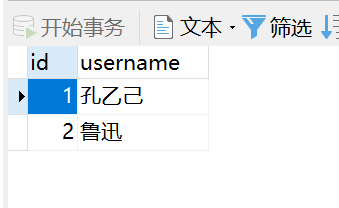
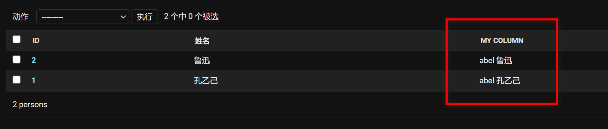
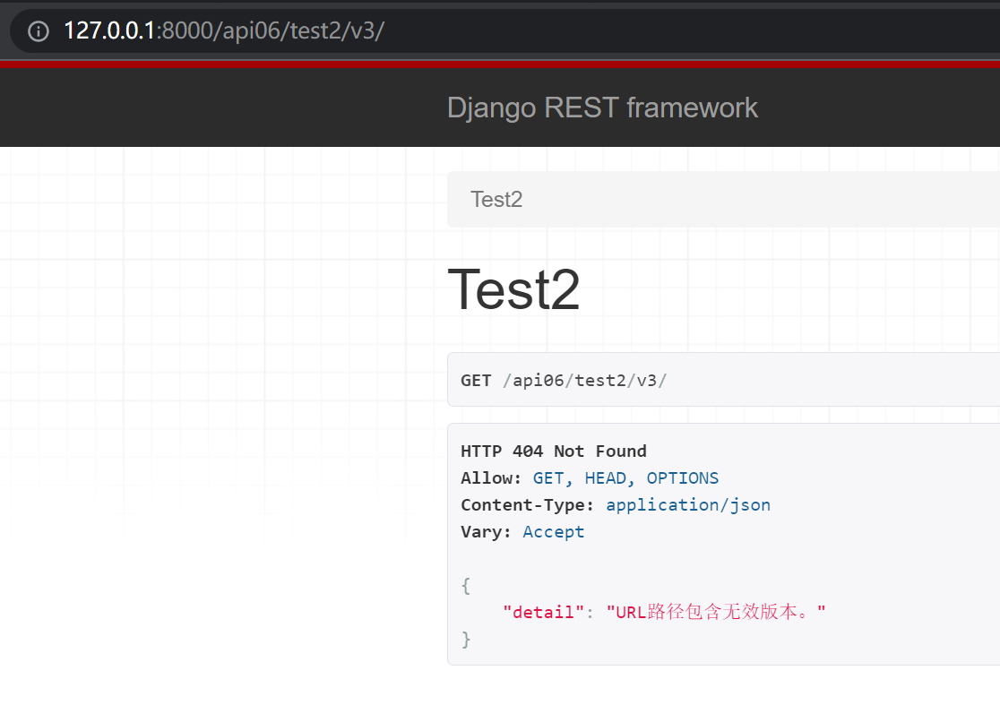
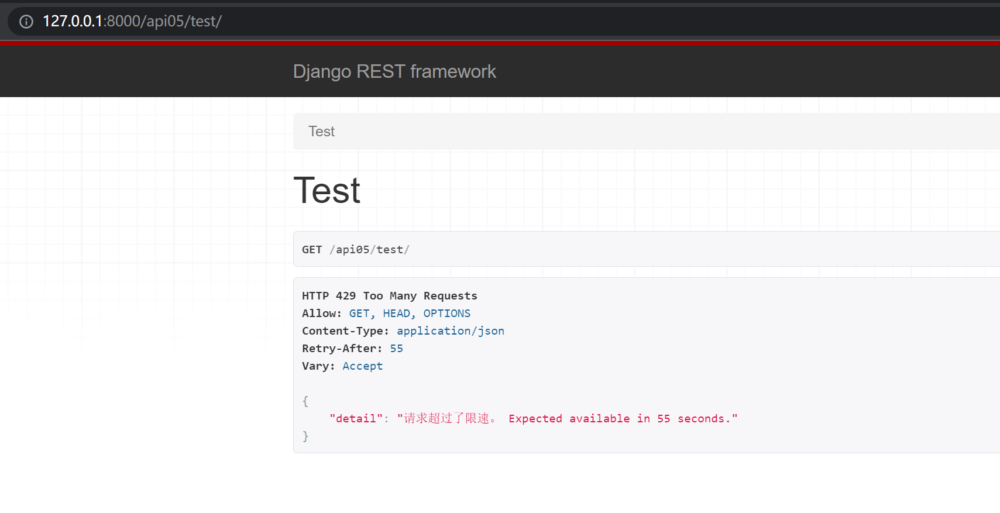
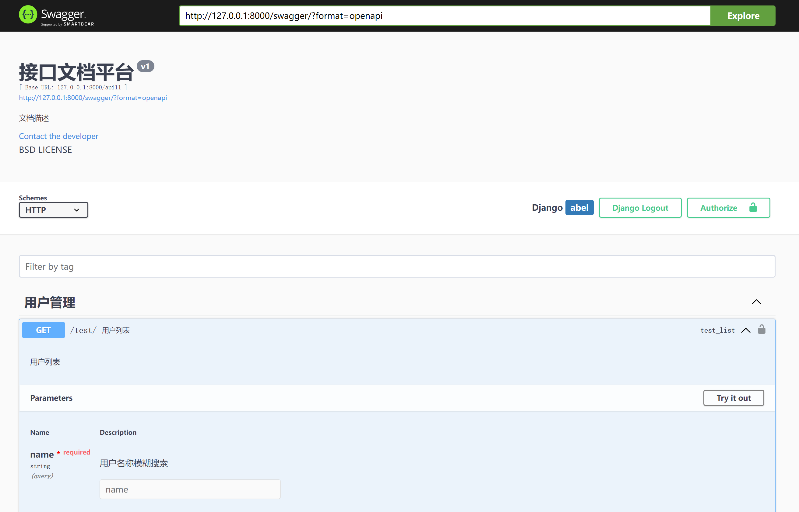
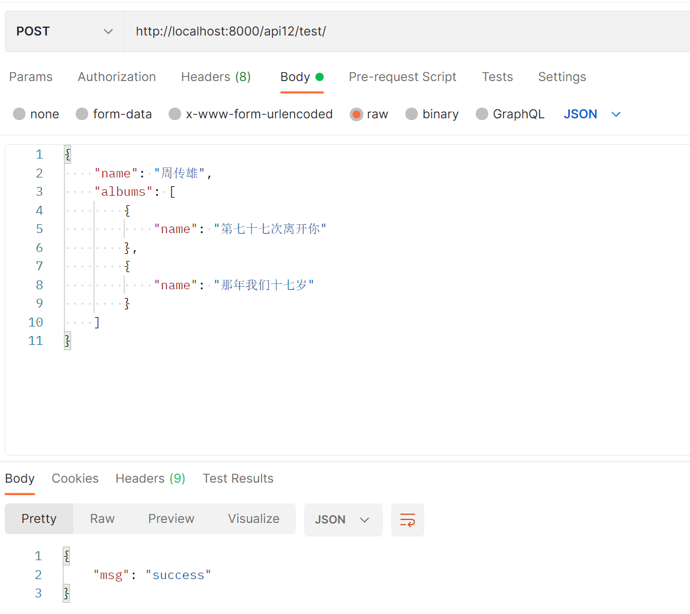

# 框架自带的认证和权限

```python
from django.contrib.auth import login, authenticate
from django.contrib.auth.models import User, Permission
from django.contrib.contenttypes.models import ContentType
from django.http import HttpResponse
# Create your views here.
from django.views import View

from api10.models import Article


class TestView(View):
    def get(self, request, *args, **kwargs):
        # 判断用户是否存在
        user: User = authenticate(username="rox", password="abel")
        # 将该用户绑定到request完成登录
        login(request, user)

        # 获取用户的所有权限
        # print(user.get_all_permissions())

        # 查询一个权限对象 从数据库中
        # p1 = Permission.objects.filter(codename="can_view").first()

        # 给用户删除一个权限
        # user.user_permissions.remove(p1)

        # 给用户添加一个权限
        # user.user_permissions.add(p1)
        # print(user.get_all_permissions())

        # 判断用户是否具有某种权限  权限字符串见下文
        # app_name.codename
        # flag = user.has_perm("api10.can_view")
        #
        # print(flag)

        # 所谓的ContentType就是django提供的专门记录数据库中各种表信息的表
        content_type = ContentType.objects.get_for_model(Article)
        permission = Permission.objects.create(codename='can_block',
                                               name='user can block article',
                                               content_type=content_type)

        return HttpResponse("abel")
```

# 框架自带的后台管理

```python
from django.db import models


# Create your models here.

class Person(models.Model):
    username = models.CharField(max_length=64, verbose_name="姓名")
```

```python
# Register your models here.
from django.contrib.admin import ModelAdmin, register

from api09.models import Person


@register(Person)
class PersonAdmin(ModelAdmin):
    list_display = ["id", "username", "my_column"]

    # hook 自定义列方法
    # 方法名 与 list_display 里面指定的新增列名需要相同
    def my_column(self, obj):
        # obj是当前行的对象
        print(obj)
        # 返回值会作为 my_column 列的内容
        return f"abel {obj.username}"

```





# 继承和扩展框架提供的User模型

> 使用框架提供的User模型好处是 可以使用框架提供的 认证和权限 免除重复造轮子

```python
from django.contrib.auth.models import AbstractUser
from django.db import models


# Create your models here.


class MyUser(AbstractUser):
    """自定义用户模型类"""

    # 额外增加 mobile 字段      长度11位        号码唯一        别名
    mobile = models.CharField(max_length=11, unique=True, verbose_name='手机号')

    # 对当前表进行相关设置:
    # class Meta:
    #     db_table = 'tb_users'

    # 在 str 魔法方法中, 返回用户名称
    def __str__(self):
        return self.username
```

```python
# settings.py
# 指定自定义的用户模型类 app_name.Model
# 通知django使用该类进行认证和权限
AUTH_USER_MODEL = 'api08.MyUser'
```

# 一对一 一对多 多对多

```python
from django.db import models


# Create your models here.

class Role(models.Model):
    role_name = models.CharField(max_length=64, verbose_name="角色名称")
    # 多对多 不需要 on_delete
    # 多对多 由于会产生中间表 中间表产生关联两头的外键 所以不会在本表中生成一个新的外键字段
    users = models.ManyToManyField(to="UserInfo", related_name="user_roles", null=True, blank=True)


class Group(models.Model):
    group_name = models.CharField(max_length=64, verbose_name="组名称")


class UserInfo(models.Model):
    username = models.CharField(max_length=64, verbose_name="用户名")
    # ForeignKey 会在本表产生一个 group_id 的外键字段
    # related_name="group_users" 反向查询   其实就相当于在 Group表中 产生一个虚拟的 group_users字段 用户查询 group_obj.group_users.all()
    group = models.ForeignKey(to=Group, on_delete=models.CASCADE, related_name="group_users", null=True, blank=True)


class UserToken(models.Model):
    token = models.CharField(max_length=64, verbose_name="token")
    user = models.OneToOneField(to=UserInfo, on_delete=models.CASCADE, related_name="user_token", null=True, blank=True)
    # OneToOneField 相当于 ForeignKey + unique约束
    # user = models.ForeignKey(to=UserInfo, on_delete=models.CASCADE, related_name="user_token", null=True, blank=True,
    #                          unique=True)

```

```python
import os
import sys

import django

sys.path.append(os.getcwd())
os.environ.setdefault("DJANGO_SETTINGS_MODULE", "drfreview.settings")

django.setup()
from api07.models import UserInfo, Role

# u1 = UserInfo.objects.create(username="abel")
# UserToken.objects.create(token=str(uuid4()), user=u1)

# 正向查找
# ut: UserToken = UserToken.objects.first()
# print(ut.user)


# 反向查找
user: UserInfo = UserInfo.objects.first()
print(user)
# print(user.user_token.all())


roles = user.user_roles.all()
print(roles)

r1: Role = Role.objects.filter(role_name="老师").first()

print(r1.users.all())

# r1.users.add(UserInfo.objects.create(username="rox"))
```

# 版本控制

```python
re_path(r'^test2/(?P<version>[v1|v2|v3]+)/$', Test2View.as_view(), name="test2"),
```

```python
from rest_framework.versioning import URLPathVersioning

class Test2View(APIView):
    versioning_class = URLPathVersioning

    def get(self, request, *args, **kwargs):
        # version = request.GET.get("version")
        print(request.version, request.versioning_scheme)
        data = {"code": 200}
        return Response(data=data)
```

```python
REST_FRAMEWORK = {
    'VERSION_PARAM': 'version',
    'DEFAULT_VERSION': 'v1',
    'ALLOWED_VERSIONS': ['v1', 'v2'],
    # 'DEFAULT_VERSIONING_CLASS': 'rest_framework.versioning.URLPathVersioning',
}
```



# 访问频率控制

```python
# Create your views here.
import time

from rest_framework.request import Request
from rest_framework.response import Response
from rest_framework.throttling import SimpleRateThrottle
from rest_framework.views import APIView


class MT2(SimpleRateThrottle):
    scope = "scope"
    THROTTLE_RATES = {
        "scope": "3/m"
    }

    def get_cache_key(self, request, view):
        if request.META.get('HTTP_X_FORWARDED_FOR'):
            ip = request.META.get("HTTP_X_FORWARDED_FOR")
        else:
            ip = request.META.get("REMOTE_ADDR")
        return ip


VISIT_RECORD = {

}


# from rest_framework.throttling import BaseThrottle
class MyThrottle:
    """
    完全自定义的频率控制  有助于了解节流原理
    """

    def __init__(self):
        self.records = None
        self.duration = 10

    def allow_request(self, request: Request, view):
        """
        重写该方法 进行计算是否被限流
        :param request:
        :param view:
        :return:
        """
        if request.META.get('HTTP_X_FORWARDED_FOR'):
            ip = request.META.get("HTTP_X_FORWARDED_FOR")
        else:
            ip = request.META.get("REMOTE_ADDR")
        print(ip)
        now = time.time()
        if ip not in VISIT_RECORD:
            VISIT_RECORD.update({ip: [now]})
            return True
        else:
            records = VISIT_RECORD.get(ip)
            self.records = records
            while records and now - records[-1] > self.duration:
                records.pop()

            if len(records) < 3:
                records.insert(0, now)
                return True
        return False

    def wait(self):
        """
        重写该方法 用来提示节流还有多上时间结束
        :return:
        """
        return self.duration - (time.time() - self.records[-1])


class TestView(APIView):
    throttle_classes = [MT2]

    def get(self, request, *args, **kwargs):
        data = {"code": 111}
        return Response(data=data)

```



# ContentType django提供的多表关联

```python
from django.contrib.contenttypes.fields import GenericForeignKey, GenericRelation
from django.contrib.contenttypes.models import ContentType
from django.db import models


# Create your models here.


class Course(models.Model):
    name = models.CharField(max_length=64, verbose_name="课程名称")
    # 不生成数据库字段  反向关联 course_obj.prices.all() 拿到所有的价格策略
    prices = GenericRelation("PricePolicy")


class DegreeCourse(models.Model):
    name = models.CharField(max_length=64, verbose_name="课程名称")
    # 不生成数据库字段  反向关联
    prices = GenericRelation("PricePolicy")


class PricePolicy(models.Model):
    price = models.FloatField(verbose_name="价格")

    content_type = models.ForeignKey(ContentType, verbose_name="关联表的表名", on_delete=models.CASCADE)
    object_id = models.IntegerField(verbose_name="关联表中的行ID")
    # 不生成字段 辅助content type 操作
    # PricePolicy.objects.create(price=9.9, content_object=course_obj)
    content_object = GenericForeignKey("content_type", "object_id")

```

```python
# Create your views here.
from rest_framework.response import Response
from rest_framework.views import APIView

from api04.models import DegreeCourse


class TestView(APIView):
    def get(self, request, *args, **kwargs):
        obj = DegreeCourse.objects.filter(name="Java").first()
        # PricePolicy.objects.create(price=9.9, content_object=obj)
        # PricePolicy.objects.create(price=19.9, content_object=obj)
        # PricePolicy.objects.create(price=29.9, content_object=obj)
        print(obj.prices.all())
        return Response({"code": 1})
```

# 模型管理器

> 可以在模型管理器中自定义方法
>
> 可以在模型管理器中重写filter，做逻辑删除

```python
from django.db import models, connection


# Create your models here.
class MyBaseModelManager(models.Manager):

    def get_queryset(self):
        return super().get_queryset().filter(is_delete=False)

    @staticmethod
    def raw_sql_query(sql: str) -> list[dict[str, str or int]]:
        """
        原生sql查询
        :param sql:
        :return:
        """
        with connection.cursor() as cursor:
            cursor.execute(sql)
            columns = [col[0] for col in cursor.description]
            datas = [dict(zip(columns, row)) for row in cursor.fetchall()]
            return datas


class MyModelManager(MyBaseModelManager):
    def get_id_gt_5(self):
        return self.model.mm.filter(id__gt=5)

    def get_id_lt_5(self):
        return self.model.mm.filter(id__lt=5)


class Dog(models.Model):
    name = models.CharField(max_length=64, verbose_name="名字")
    is_delete = models.BooleanField(default=False, verbose_name="是否被删除")

    # 指定模型管理器 默认为 objects
    mm = MyModelManager()

    def __str__(self):
        return f"{self.name} - {self.is_delete}"


```

# 分页

```python
class MyPagination(PageNumberPagination):
    page_size = 3
    page_size_query_param = "size"
    max_page_size = 10
```

```python
class T2View(APIView):
    pagination_class = MyPagination
```

# swagger接口文档

```bash
pip install drf_yasg
```

```python
INSTALLED_APPS = [
	...
    "rest_framework",
    'drf_yasg',  # swagger文档
]
```

```python


from django.contrib import admin
from django.urls import path, include
from drf_yasg import openapi
from drf_yasg.views import get_schema_view

schema_view = get_schema_view(
    openapi.Info(
        title="接口文档平台",  # 必传
        default_version='v1',  # 必传
        description="文档描述",
        terms_of_service='',
        contact=openapi.Contact(email="1093254791@qq.com"),
        license=openapi.License(name="BSD LICENSE")
    ),
    public=True,
    # permission_classes=(permissions.)  # 权限类
)

urlpatterns = [
    path('admin/', admin.site.urls),

    path('swagger/', schema_view.with_ui('swagger', cache_timeout=0), name='schema-swagger'),
    path('redoc/', schema_view.with_ui('redoc', cache_timeout=0), name='schema-redoc'),

]

```

```python
# Create your views here.
from drf_yasg import openapi
from drf_yasg.utils import swagger_auto_schema
from rest_framework.response import Response
from rest_framework.views import APIView


class TestView(APIView):

    @swagger_auto_schema(
        # 接口描述，支持markdown语法
        operation_description=""" 用户列表""",
        # 接口参数 GET请求参数
        manual_parameters=[
            # 声明参数
            openapi.Parameter(
                # 参数名称
                "name",
                # 参数形式  ?name=abel 的形式传参
                openapi.IN_QUERY,
                # 参数描述
                description="用户名称模糊搜索",
                # 参数类型
                type=openapi.TYPE_STRING,
                # 是否必填
                required=True,
            ),
        ],
        # 接口标题
        operation_summary='用户列表',
        # 接口所属分组，会单独将接口拆出来放到 用户管理 分组中
        tags=['用户管理']
    )
    def get(self, request, *args, **kwargs):
        return Response({"code": 2})
```



# 序列化（嵌套）及验证

```python
from django.db import models


class Singer(models.Model):
    name = models.CharField(max_length=64, verbose_name="歌手名称")


class Album(models.Model):
    name = models.CharField(max_length=64, verbose_name="专辑名称")

    singer = models.ForeignKey(to=Singer, related_name="albums", on_delete=models.CASCADE, verbose_name="所属歌手",
                               null=True, blank=True)
```

```python

from typing import OrderedDict

from rest_framework import serializers

from api12.models import Singer, Album


class AlbumSer(serializers.ModelSerializer):
    class Meta:
        model = Album
        fields = "__all__"


class SingerSer(serializers.ModelSerializer):
    # 体现反向关联 序列化器嵌套
    # 此处的名称需要与 外键中指定的 related_name="albums" 一致
    albums = AlbumSer(many=True)

    class Meta:
        model = Singer
        fields = "__all__"

    def create(self, validated_data: dict):
        albums_data = validated_data.pop("albums")
        singer_obj: Singer = super().create(validated_data)

        print("++++", albums_data)
        album_objs = [Album.objects.create(**album) for album in albums_data]
        # [singer_obj.albums.add(Album.objects.create(**album)) for album in albums]
        # 新版django中，orm多对多外健不再用=等赋值,改为set方法
        singer_obj.albums.set(album_objs)
        return singer_obj

    def validate_name(self, data):
        """
        验证单个数据
        :param data:
        :return:
        """
        print("验证", data)
        return data

    def validate(self, data: OrderedDict):
        """
        同时验证所有数据
        :param data:
        :return:
        """
        print("验证", data)
        return data

```

```python
# Create your views here.
from rest_framework.request import Request
from rest_framework.response import Response
from rest_framework.views import APIView

from api12.MySerializer import SingerSer


class TestView(APIView):

    def post(self, request: Request, *args, **kwargs):
        print(request.data, type(request.data))
        ser = SingerSer(data=request.data)
        print(ser.initial_data)
        if ser.is_valid():
            print("----", ser.validated_data)
            ser.save()
        else:
            print("没通过校验")
            print(ser.errors)
        data = {
            "msg": "success"
        }
        return Response(data=data)
```



# 事务

方式一：装饰器

```python
from django.db import transaction
 
class A(APIView):
    @transaction.atomic   # 导入事务
    def post(self, request, *args, **kwargs):
    		try:
                save_id = transaction.savepoint() # 记录节点
                pass  # 操作内容
                transaction.savepoint_commit(save_id) # 提交从上个节点到现在的改动到数据库
                return HttpResponse("OK2")
            except Exception as e:
                transaction.savepoint_rollback(save_id) # 回到节点
                return HttpResponse("错误")

```

方式二：with语法

```python
from django.db import transaction
 
class A(APIView):
    def post(self, request, *args, **kwargs):
		with transaction.atomic(): # 导入事务
    		try:
        		save_id = transaction.savepoint() # 记录节点
        		pass  # 操作内容
        		transaction.savepoint_commit(save_id) # 提交从上个节点到现在的改动到数据库
				return HttpResponse("OK2")
   	 		except Exception as e:
        		transaction.savepoint_rollback(save_id) # 回到节点
        		return HttpResponse("错误")
```

