### GIT培训讲义

> 作者：程义军
>
> 时间：2022-07-06

#### 1 为什么是GIT而不是SVN

- SVN由于是集中式的架构，一旦中央仓库服务器宕机，版本控制工作就彻底失效；GIT是分布式的，每个工作节点都有相对完整的仓库备份，远程仓库离线也不影响正常的版本控制工作。
- SVN绝大部分操作都要请求网络，版本回退或者切换分支比较慢；GIT大部分操作是基于本地的，版本回退或者切换分支非常快（只是移动了Head指针）。
- 便于和`Jenkins`之类的`CI/DI`测试工作流软件进行集成，进行高效的自动化测试与部署。
- GIT对于文件的存储进行了优化，大幅降低了存储空间占用。

#### 2 git的工作流图

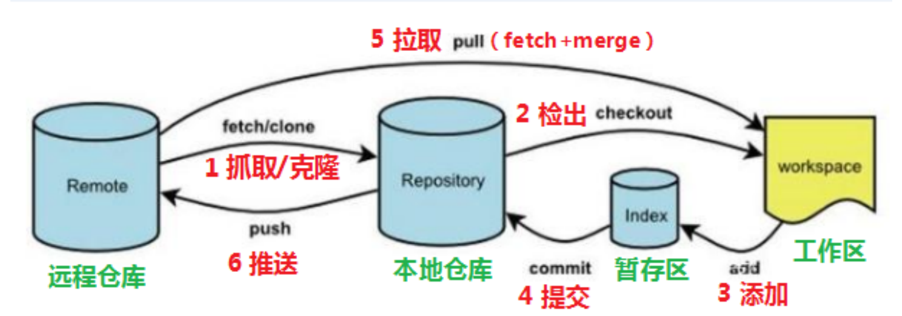

#### 3 git的基本操作

1. clone
2. checkout
3. add
4. commit
5. pull
6. fetch （fetch+merge=pull）
7. merge
8. push
9. status
10. log
10. diff
10. init

#### 4 git进阶操作

1. 丢弃工作区的改动

   ~~~bash
   # 丢弃所有改动
   git checkout .
   # 丢弃单个文件的改动
   git checkout -- fileName
   ~~~

2. 丢弃暂存区的记录

   ```bash
   # 丢弃所有记录
   git restore --staged .
   # 丢弃单个记录
   git restore --staged fileName
   ```

3. 从本地仓库撤销提交

   ```bash
   git revert commitID
   ```

4. 时光机（版本回退）

   ```bash
   git reset --hard commitID # 回退版本 并将改动彻底丢弃 （推荐使用）
   
   git reset --soft commitID # 回退版本 并将改动撤回到暂存中
   git reset --mixed commitID # 回退版本 并将改动撤回到工作区中 mixed为缺省参数
   
   
   # 一些特殊的简写 (相对于当前Head指针回退一个版本)
   git reset --hard Head^
   git reset --hard Head~1
   ```

5. 合并别人的代码（解决冲突）

   > 所谓冲突是指两个不同commit对同一个文件的同一行进行了不同操作

   ```bash
   # 合并之前查看分支差异
   git diff branchName
   # 根据差异解决冲突 然后再合并
   git merge branchName
   ```

   本地和远端同一个文件的同一行存在差异 则会产生冲突，以下是冲突的直观展示：

   `git diff origin/main`

   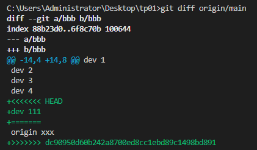

   或者IDE里面可以观察到：

   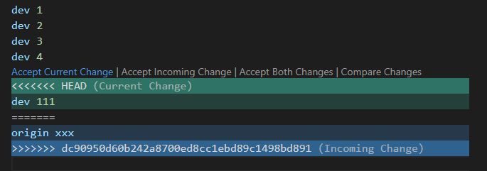

6. Tag打标发布版本（版本冻结 打包归档）

   > 所谓Tag其实就是一种特殊的Branch，主要作用为冻结版本，进行正式版本发布

   ```bash
   # 创建tag
   git tag -a V1.0.1 -m "message"
   
   # 查看所有标签
   git tag -l
   
   # 查看标签详细信息
   git show tagName
   
   # 将指定的标签上传到远程仓库
   git push origin tagName 
   # 将所有不在远程仓库中的标签上传到远程仓库
   git push origin --tags 
   
   # 删除本地标签
   git tag -d V1.0.2
   # 删除远端标签
   git push origin :V1.0.2
   
   # 根据标签打包
   git archive V1.0.1 --format=zip --output=V1.0.1.zip
   
   # 支持的打包格式
   git archive --list
   tar
   tgz
   tar.gz
   zip
   
   # 根据标签创建对应的发版分支
   git checkout -b newBranchName tagName
   ```

   6. 分支操作

   ```bash
   # 创建分支
   git branch branchName
   git checkout -b branchName
   git push origin branchName:branchName
   
   # 查看分支
   git branch # 查看本地分支
   git branch -a # 查看本地分支+远程分支
   
   # 删除分支
   git branch -d branchName # 删除本地分支
   git branch -D branchName # 删除本地分支（强制）
   git push origin :branchName # 删除远程分支
   git push origin --delete branchName # 删除远程分支
   
   # 通过fetch获取更新创建分支
   git fetch origin main:tmp
   # 通常的后续操作
   git diff tmp
   git merge tmp
   git branch -d tmp
   ```

#### 5 git的高阶操作

1. 当你正在开发的功能开发了一半，此时来了紧急任务修复重大BUG，你该怎么做？（git stash）

   ```bash
   # 临时存储改动
   git stash
   # 正常修改bug 并提交
   ...
   # 恢复临时改动
   git stash pop stash@{0}
   # 继续改动 正常干活
   ...
   
   # 删除临时改动
   git stash drop stash@{0}
   
   # 查看所有的临时存储
   git stash list
   ```

2. 当你的个人的个人开发分支A与同事的开发分支B分离比较久了，同事已经修复了一个重大BUG，你也想在你的feature发布前获取这个修复，你该怎么做？

   ```bash
   # 精确获取其他分支上的指定commit到本分支 并形成一个新的提交
   git cherry-pick commitID
   ```

#### 6 常见的难以理解的点

1. fast-forward的作用

   

2. rebase变基

  > 注意变基与合并的区别

  首先通过简单的提交节点图解感受一下rebase在干什么
  两个分支master和feature，其中feature是在提交点B处从master上拉出的分支
  master上有一个新提交M，feature上有两个新提交C和D


```bash
git switch feature
git rebase master

# 以上两句等价于 (可以简单理解为：将master里的commit 放到 feature上)
git rebase master feature

# 如果提示有冲突就解决冲突
...

# 解决冲突后继续变基
git rebase --continue
```


原理说明：

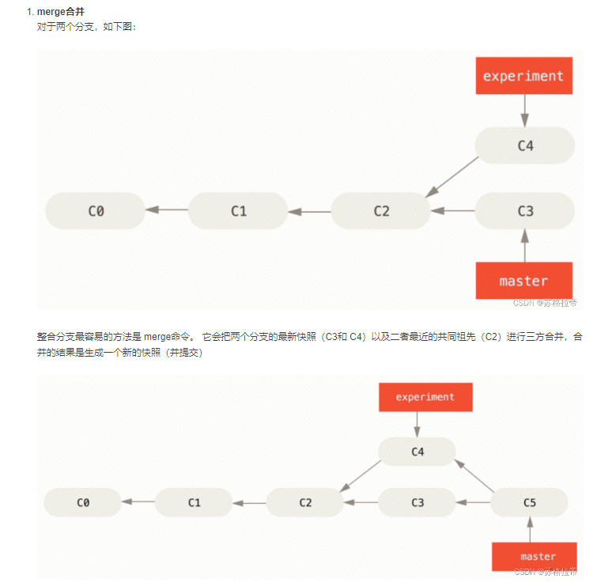

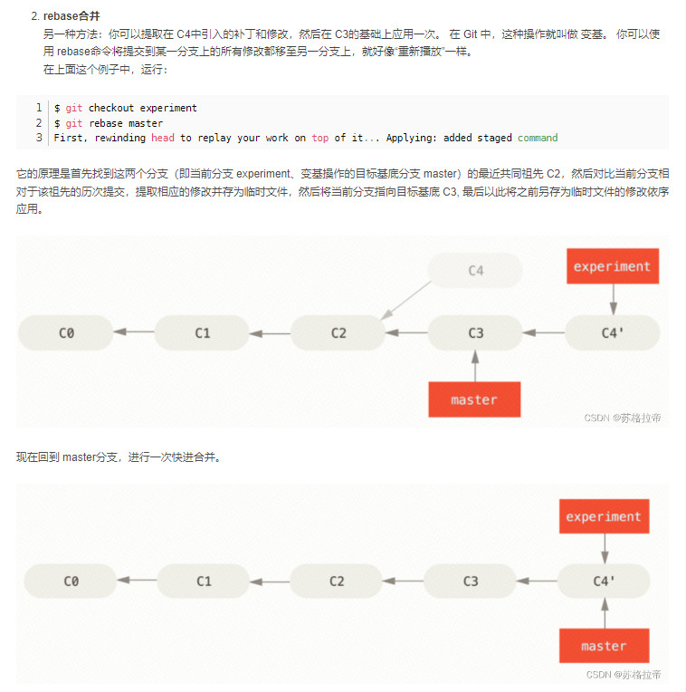

#### 7 一些规范

1. git默认的主分支：master分支名已经弃用 现在都叫main分支

   由于黑人开发者的增多，鉴于黑人被种族歧视的历史（Master-Slave），黑人对git中的默认master分支提出抗议，2020年6月8日 Scott 发文呼吁将你的Git默认分支从`master`修改为`main`，目前国外各大主流软件商均已更改，Github也已弃用master改用main分支名，以示尊重。

2. 大公司一般通用的简单分支模型

   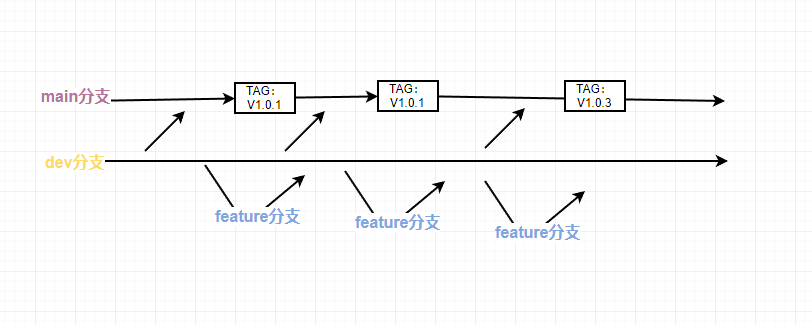

 > main分支：只用来打标TAG 用户版本代码冻结 进行发版
 > dev分支：用来正常开发 迭代commit
 > feature分支：用来开发新功能，新功能开发完毕之后向dev合并
 > bug分支：类似feature分支 进行bug修复 修复后向dev合并

3. `.gitignore`文件必须写

   > `.gitignore`文件必须写，指定无需提交的文件及文件夹
   >
   > 如：ide的配置 编译产生的中间产物 第三方依赖库 都需要忽略

#### 8 git与gitlab的配套使用

1. 先在gitlab创建空白仓库再克隆

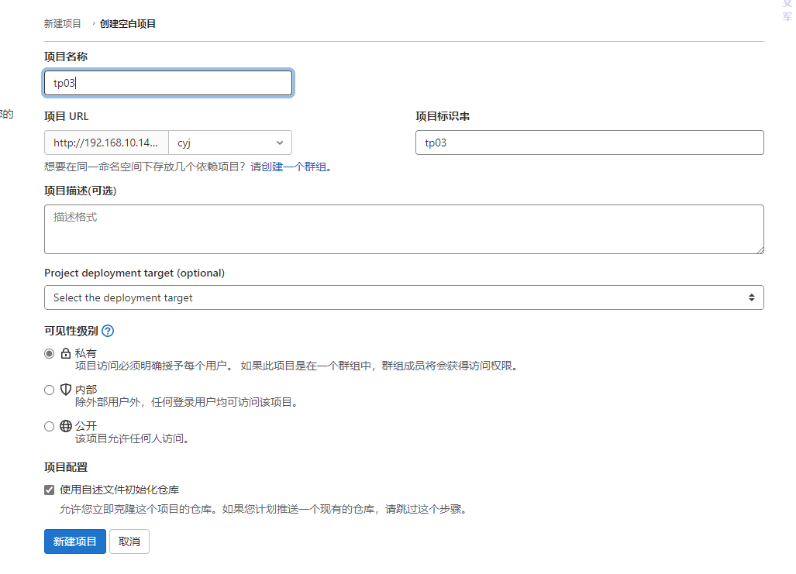

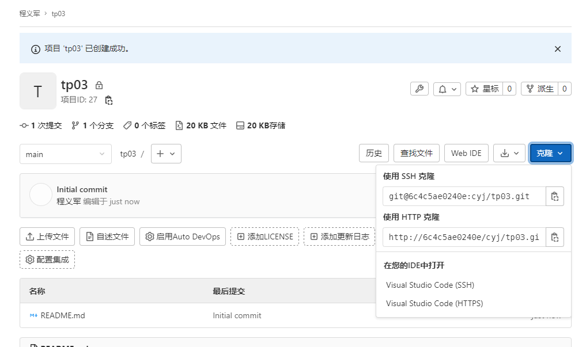

> *注意：*将仓库地址进行一个替换 如下：
>
> <http://6c4c5ae0240e/cyj/tp03.git>
> <http://192.168.10.141:9980/cyj/tp03.git>

`git clone http://192.168.10.141:9980/cyj/tp03.git`

2. 针对本地 已经存在的项目 推送到gitlab
   1. 进入项目目录 执行`git init .` 初始化仓库
   2. 在gitlab上创建仓库

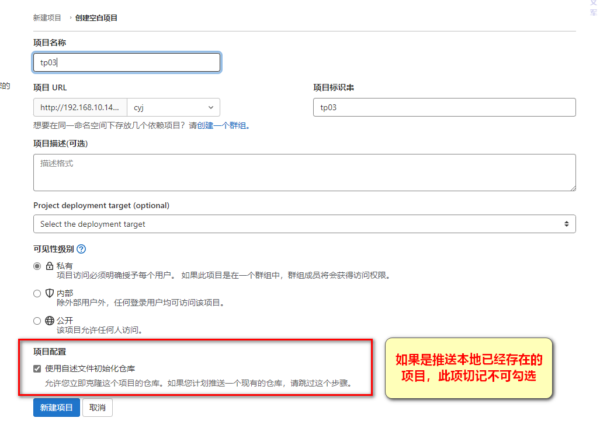

如果勾选了，会报出如下错误：

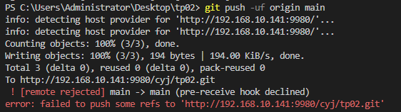

```bash
cd existing_repo
git remote add origin http://192.168.10.141:9980/cyj/tp03.git # 指定远程仓库的位置
git branch -M main # 将当前分支重命名为main （gitlab默认就会创建main作为主分支 作为对应远程分支）
git push -uf origin main # -ub表示--set-upstream和远程仓库建立映射关系  其实等价于 git push origin main:main
```

3. 关于项目成员推送提交

   > 默认是需要项目仓库所有者自己审核PR

   如果想取消可以进行如下操作：

   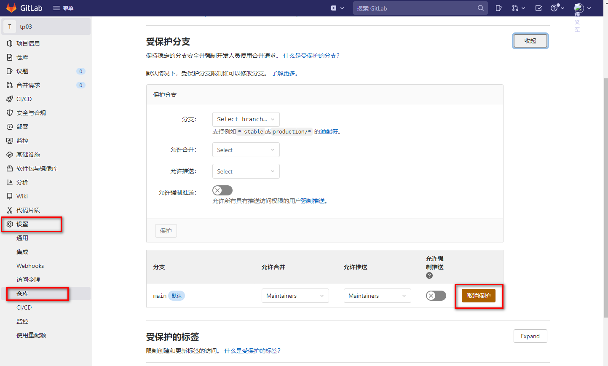

4. 如果向远端推送，提示换行符警告，可以执行自动转换命令

   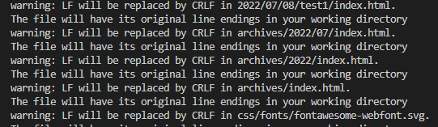

```bash
# 开启换行符自动转换
git config --global core.autocrlf true

# 补充知识
win： CRLF => "\r\n"
Linux: LF => "\n"
```
