##### 1 到底如何撤销

> 很多人问我 我到底该如何撤销某部分代码？这个要分不同的阶段来处理。

- 已经commit

  可以通过`git reset`来回滚版本

  ```bash
  git reset --hard CommitID
  git reset --hard Head~
  ```

  还可以通过`git revert`来反做指定`CommitID`

  ```
  git revert CommitID
  ```

  > 原理： git revert是用于“反做”某一个版本，以达到撤销该版本的修改的目的。比如，我们commit了三个版本（版本一、版本二、 版本三），突然发现版本二不行（如：有bug），想要撤销版本二，但又不想影响撤销版本三的提交，就可以用 git revert 命令来反做版本二，生成新的版本四，这个版本四里会保留版本三的东西，但撤销了版本二的东西。如下图所示：

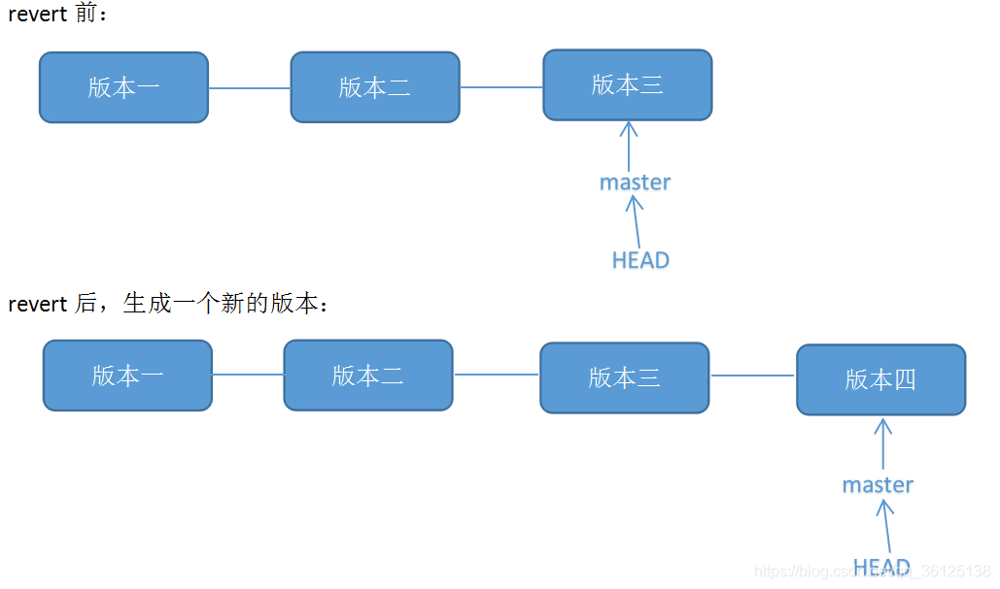

git revert 之后会形成一个新的提交

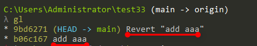

- 已经add

  ```bash
  git restore --staged .
  git restore --staged FileName
  ```

- 还未add

  ```bash
  git checkout .
  git checkout FileName
  ```

##### 2 一个bug到底要修几次

> 我在`dev`分支已经修改某个bug了（或者别人已修复过该bug了），但是我还有功能没开发完，不能合并分支，线上又急需修复这个bug，我该怎么办，是去`main` 分支再修复一遍吗？

```bash
git checkout main
git cherry-pick c091b35
```

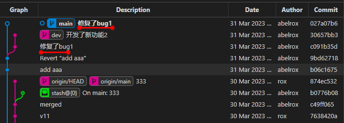

##### 3 新功能开发了一半，如何去别的分支修bug

> 由于我当前所处的feature分支是不干净的（有未提交的内容），这时候是切换不了分支，拉取不了新内容的。

有三种应对方式：

1. 丢弃当前分支上的新开发内容 （相当于这一部分白干）
2. 将开发一半的功能进行提交 （由于开发没完成 可能导致程序跑不起来）
3. 通过git stash 暂存当前分支的开发场景，让当前分支保持干净，处理完其他工作之后，可以通过git stash 恢复当前分支工作区状态

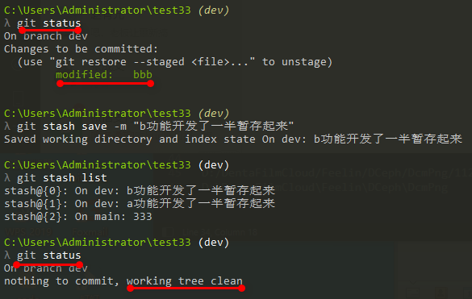

从stash恢复保存的工作区场景

```bash
git stash apply stash@{0}
git stash pop
```

从stash删除暂存

```bash
git stash drop stash@{0}
git stash clear
```

##### 4 瞎写的提交备注怎么修改

> 很多人喜欢写一些无意义的提交备注 这非常不可取 这与不用版本管理无异 因为时间长了以后 你根本不知道该提交是什么

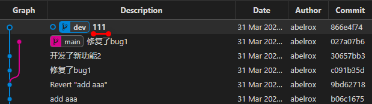

```bash
git rebase -i Head~3
```

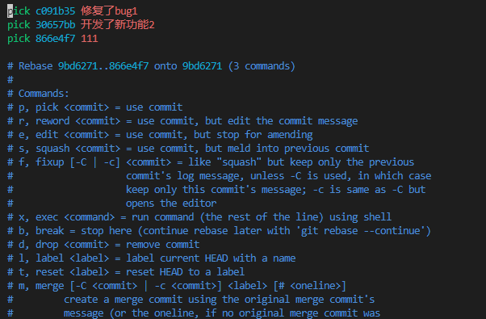

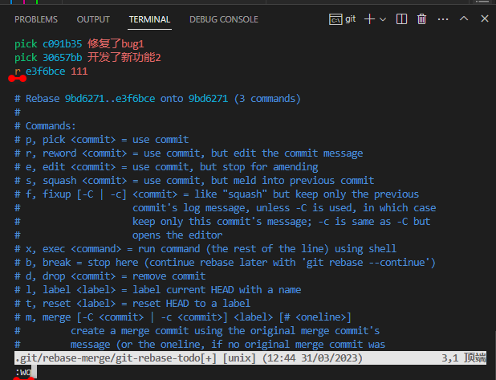

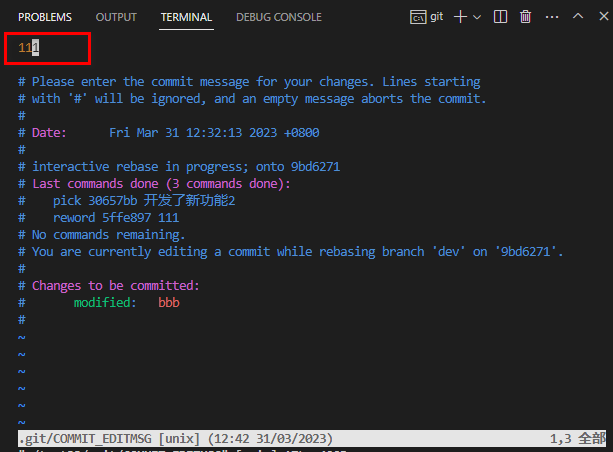

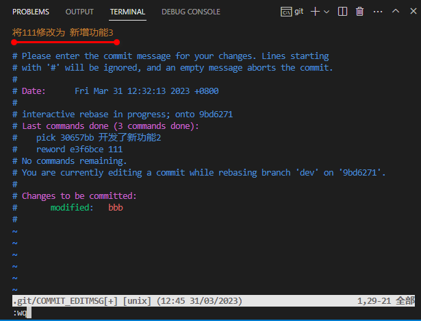

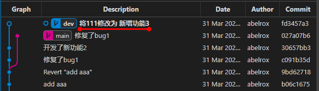

##### 5 一个功能本地分了好几个提交，如何合并为一个完整提交

> 一个功能分好几个提交，push之后会让其他的合作开发人员感到费解，摸不着头脑，也不利于后期版本管理快速找到某一功能

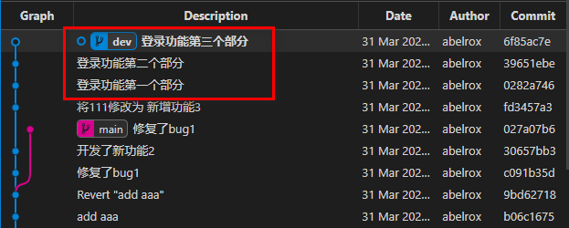

```bash
git rebase -i Head~3
```

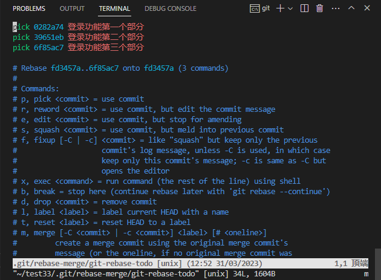

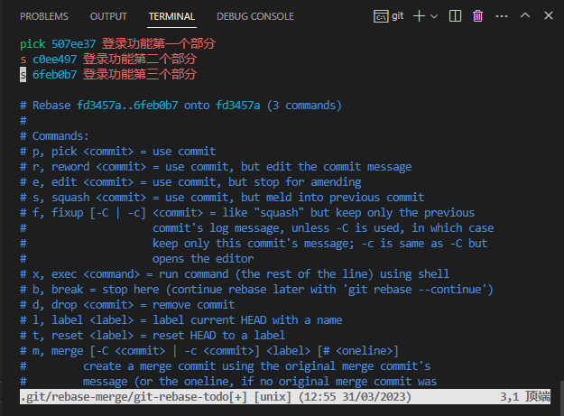

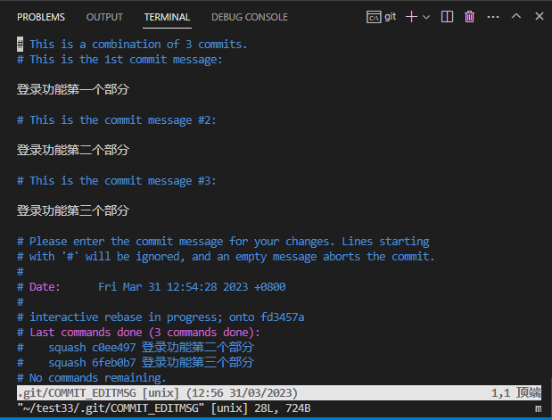

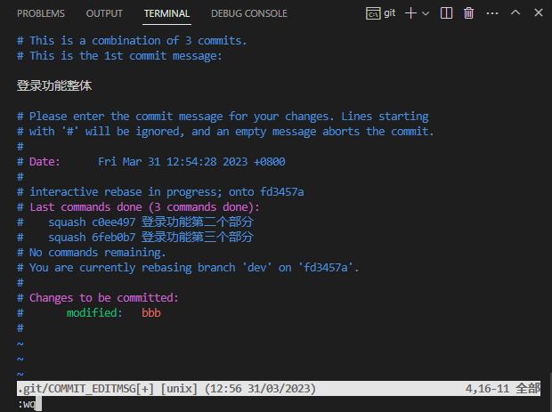

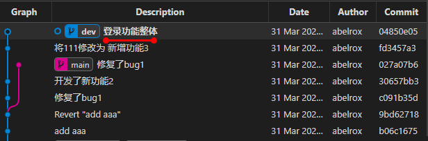


##### 6 push的时候，警告换行符问题

> 如果不管警告 push上去之后 协同开发的人员拉取下来，会影响他的代码比对


```bash
# 推荐配置
# 提交检出均不转换
git config --global core.autocrlf false
# 允许提交包含混合换行符的文件
git config --global core.safecrlf false
```

##### 7 怎么样快速定位冲突

> `git mergetool`  冲突发生后，通过这个工具，很快就能定位到冲突发生的地方 方便进行冲突解决

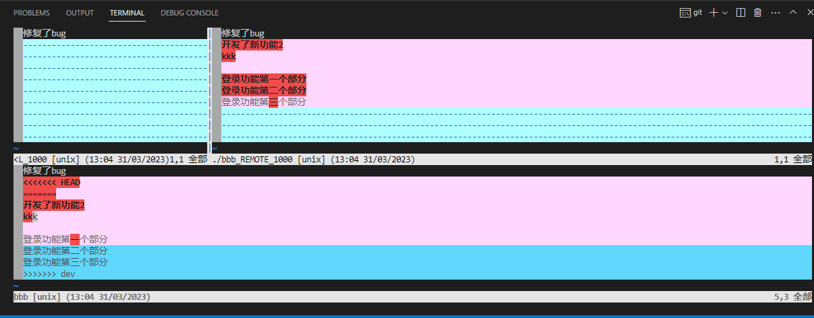

注意：解决玩冲突之后一定要提交，要不然git是不知道你已经解决了冲突的。

##### 8 我`.gitignore`文件写晚了，已经提交并push了我不想被版本管理起来的文件

> 一些文件由于在加入`.gitignore`之前已经被提交和推送了，但是我又不能删掉本地的，怎么处理？
>
> 比如：第三方库，临时编译文件，编译结果文件

```bash
git ls-files
git rm --cached FileName
git rm -rf --cached DirName
```

##### 9 分支模型和打标签

主流的分支管理模型：


打标签

> 所谓**Tag**其实就是一种特殊的Branch，或者说是给某个CommitID取了个别名，主要作用为冻结版本，进行正式版本发布

```bash
# 查看标签
git tag -l
# 打标签
git tag -a V1.0.5 -m "V1.0.5正式版本"
```

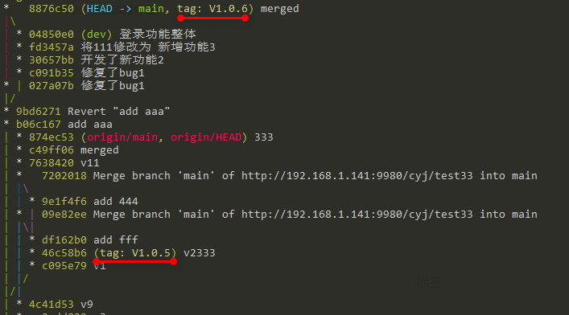

```bash
# 向远端推送标签
git tag push origin TagName
git tag push origin --tags
```

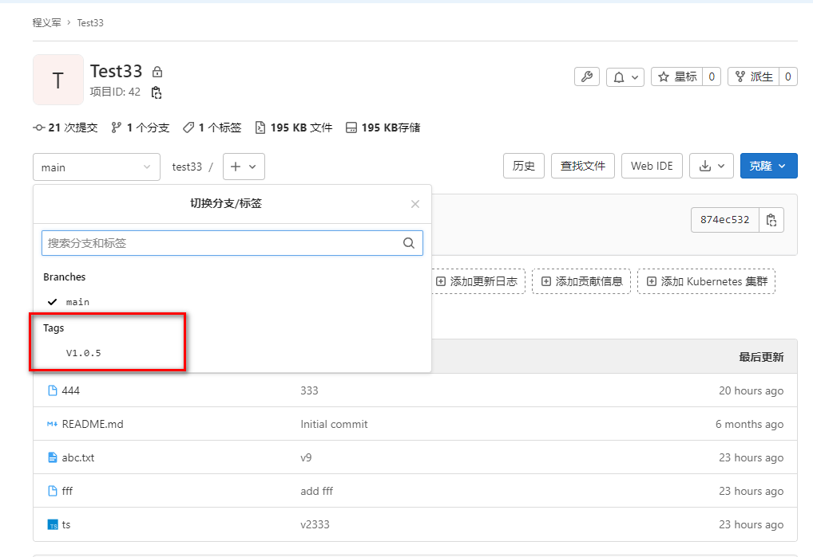

```bash
# 通过标签获取发版版本到新分支
git checkout -b 新分支名 TagName

# 根据标签打包
git archive TagName --format=zip --output=V1.0.5.zip

# 支持的打包格式
git archive --list
tar
tgz
tar.gz
zip
```

