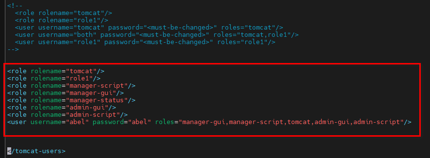
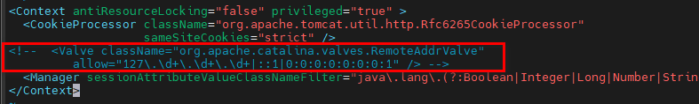
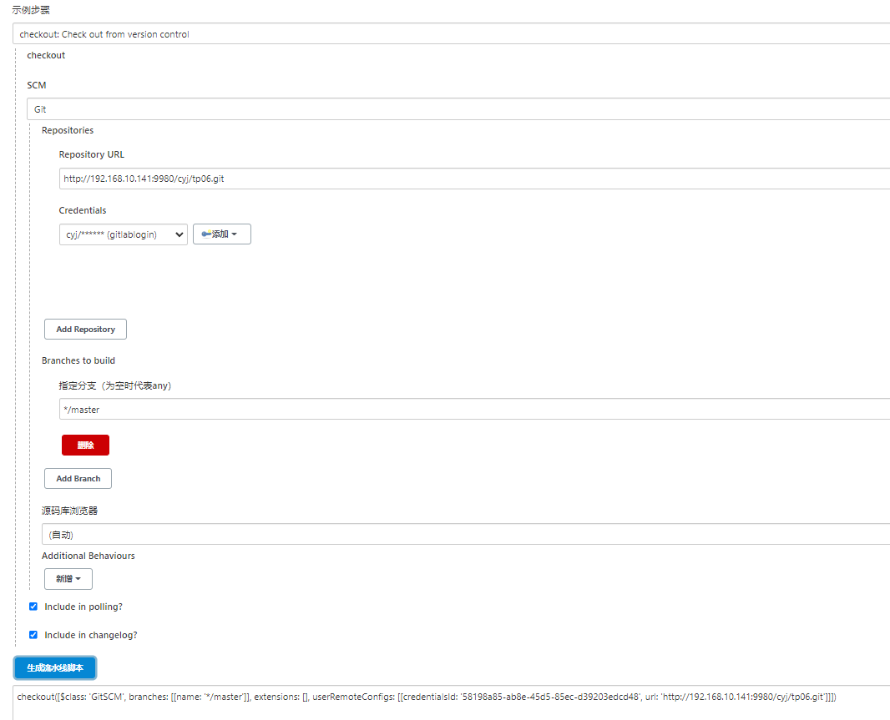
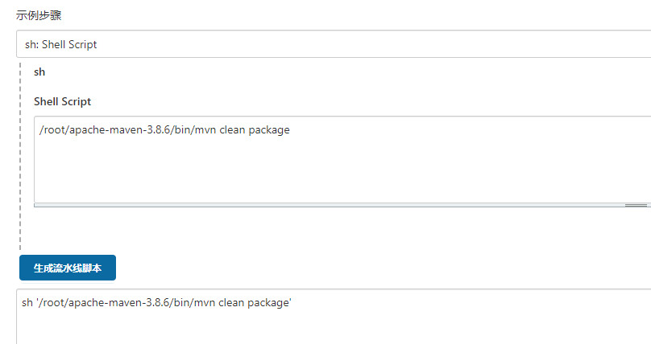
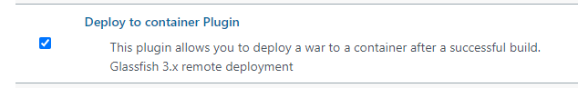
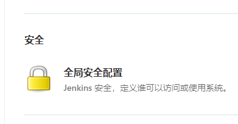
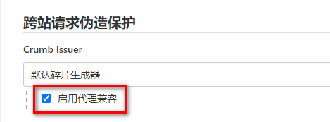
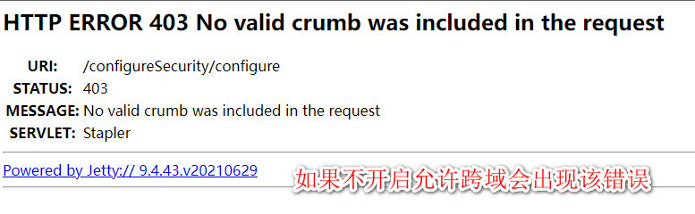
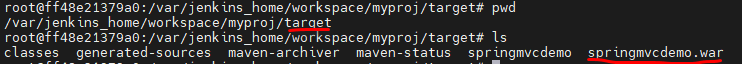
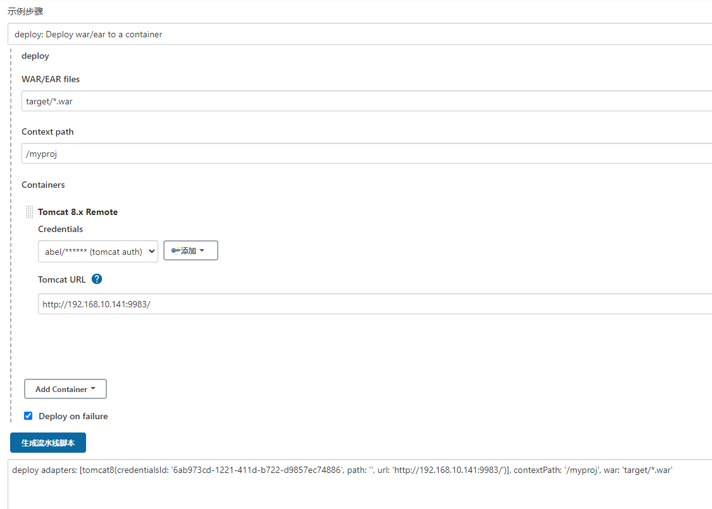

# 安装gitlab

```bash
docker pull gitlab-ce:latest

docker run -dit --name gitlab -p 9980:80 -v ${HOME}/config:/etc/gitlab -v ${HOME}/logs:/var/log/gitlab -v ${HOME}/data:/var/opt/gitlab gitlab-ce:latest


# 如果想设置自启动
docker update --restart=always 容器名称
```

# 安装jenkins

```bash
# 安装
docker pull jenkins:lts
docker run -d --name jenkins -u root -p 9982:8080 -p 50000:50000 --privileged=true  -v ${HOME}/jenkins_home:/var/jenkins_home -v /var/run/docker.sock:/var/run/docker.sock jenkins:lts

# 访问页面
http://192.168.10.141:9982/

# 查看初始密码
docker logs jenkins

# 参考资料
https://blog.csdn.net/weixin_44249490/article/details/103687307
```

# 安装tomcat

```bash
# 安装tomcat
docker pull tomcat:8
docker run -dit --name tomcat -p 9983:8080 -v ${HOME}/webapps:/usr/local/tomcat/webapps  tomcat:8

# 进入容器 复制tomcat manager到webapps目录下
docker exec -it tomcat bash
cp -r webapps.dist/* webapps

# 修改 tomcat-users.xml 拷贝到数据卷中 然后到宿主机上改
cp conf/tomcat-users.xml webapps

# 在宿主机上修改 tomcat-users.xml
<role rolename="tomcat"/>
<role rolename="role1"/>
<role rolename="manager-script"/>
<role rolename="manager-gui"/>
<role rolename="manager-status"/>
<role rolename="admin-gui"/>
<role rolename="admin-script"/>
<user username="abel" password="abel" roles="manager-gui,manager-script,tomcat,admin-gui,admin-script"/>

# 进入容器 将tomcat-users.xml文件拷贝覆盖到conf目录下
cp webapps/tomcat-users.xml conf/
# 确认是否覆盖成功
cat conf/tomcat-users.xml

# 注释掉 context.xml 中的内容
# webapps/manager/META-INF/context.xml 由于webapps是数据卷 可以在宿主机中直接修改
注释掉 <!-- <Value className=.../> -->
具体见下图


# 重启容器
docker restart tomcat

# 访问tomcat页面
http://192.168.10.141:9983/
# 登录管理界面 上传war包进行测试
http://192.168.10.141:9983/manager
```





# 持续集成持续部署脚本

1. 流水线项目构建脚本

```bash
node {
    def mvnHome
    stage('pull code') { 
        echo 'pull code'
        checkout([$class: 'GitSCM', branches: [[name: '*/master']], extensions: [], userRemoteConfigs: [[credentialsId: '58198a85-ab8e-45d5-85ec-d39203edcd48', url: 'http://192.168.10.141:9980/cyj/tp06.git']]])
    }
    stage('build code') {
        echo 'build code'
        sh '/root/apache-maven-3.8.6/bin/mvn clean package'
    }
    stage('develop code') {
        echo 'develop code'
        deploy adapters: [tomcat8(credentialsId: '6ab973cd-1221-411d-b722-d9857ec74886', path: '', url: 'http://192.168.10.141:9983/')], contextPath: '/myproj', war: 'target/*.war'
    }
}
```

# 拉取项目代码



# 构建war包



# 部署项目

1. 安装deploy插件

   

2. 关闭跨域限制

   





3. 生成部署脚本

   war文件所在位置

   > jenkins任务名/target/*.war

   

   
