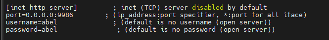
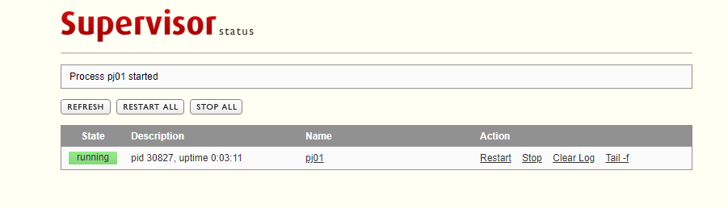

# 配置静态文件相关设置

```python
STATIC_URL = '/static/'
STATICFILES_DIRS = [BASE_DIR.joinpath("app/static")]
STATIC_ROOT = BASE_DIR.joinpath("static_all")
```

# 执行收集静态文件

```bash
python manage.py collectstatic
```

# 测试uwsgi运行

```bash
# 两种形式都行（需要在指定的虚拟环境中执行）
# 需要进入 manage.py 同级目录
uwsgi --http :9985 --wsgi-file=project01/wsgi.py --static-map /static=static_all
uwsgi --http :9985 --module=project01.wsgi --static-map /static=static_all
```

# 创建 uwsgi.ini 文件

```ini
[uwsgi]
http=0.0.0.0:9985
wsgi-file=project01/wsgi.py
static-map=/static=static_all
virtualenv=/root/.venvs/py39
```

# 通过uwsgi.ini文件启动

```bash
# 无需在虚拟环境中 因为uwsgi.ini 文件中已经指定了虚拟环境
/usr/local/python39/bin/uwsgi --ini uwsgi.ini
```

# 安装supervisor

```bash
yum install epel-release supervisor -y
```

# 配置项目设置到supervisor

```bash
cd /etc/supervisord.d/
vim pj01.ini
```

```ini
[program:pj01]
directory=/root/project01
command=/usr/local/python39/bin/uwsgi --ini uwsgi.ini
autostart=true
autorestart=false
stderr_logfile=/root/pj01/err.log
stdout_logfile=/root/pj01/info.log
#user = test
```

# 开启 supervisord

```bash
supervisord
```

开启supervisor Web服务（可选 非必须）

```bash
vim /etc/supervisord.conf
```



```bash
systemctl restart supervisord
http://ip:9986 访问web控制页面
```



命令控制 pj01 

```bash
supervisorctl status
supervisorctl start pj01
supervisorctl stop pj01
```


# 也可以使用单独的配置文件启动 supervisor

vim looptest.conf

```bash
[include]
files=/etc/supervisord.conf

[program:looptest] 
directory=/root/looptest
command=python3 test.py
autostart=true 
autorestart=false 
stderr_logfile=/root/looptest/err.log
stdout_logfile=/root/looptest/info.log
#user = test  
```

```bash
supervisord -c looptest.conf
```

