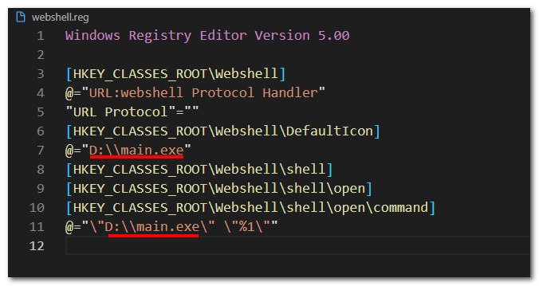
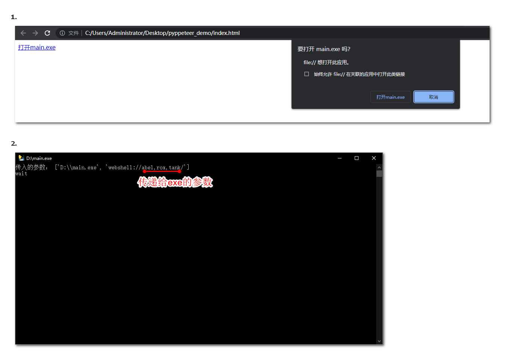

> 创建 **.reg** 注册表文件 并使用管理员权限执行
```bash
Windows Registry Editor Version 5.00

[HKEY_CLASSES_ROOT\Webshell]
@="URL:webshell Protocol Handler"
"URL Protocol"=""
[HKEY_CLASSES_ROOT\Webshell\DefaultIcon]
@="D:\\main.exe"
[HKEY_CLASSES_ROOT\Webshell\shell]
[HKEY_CLASSES_ROOT\Webshell\shell\open]
[HKEY_CLASSES_ROOT\Webshell\shell\open\command]
@="\"D:\\main.exe\" \"%1\""
```
> 只需要替换红线部分为目标exe路径



```html
<!DOCTYPE html>
<html lang="en">
<head>
  <meta charset="UTF-8">
  <meta name="viewport" content="width=device-width, initial-scale=1.0">
  <title>打开EXE</title>
</head>
<body>
  <a href="webshell://abel,rox,tank">
    打开main.exe
  </a>
</body>
</html>

```


> main.py 生成 main.exe 做测试

```python
import sys

print("传入的参数：", sys.argv)
input("wait")
```


